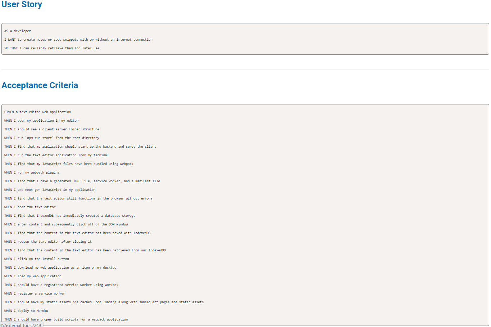
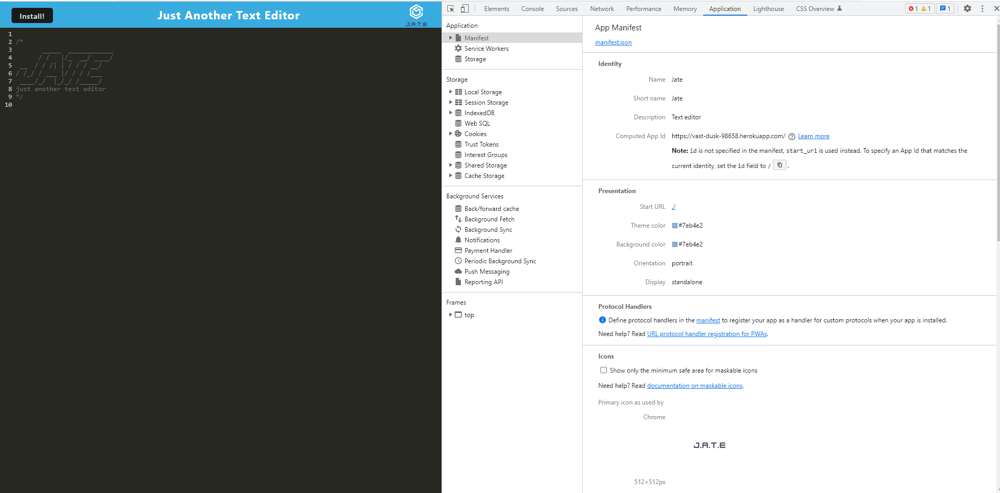
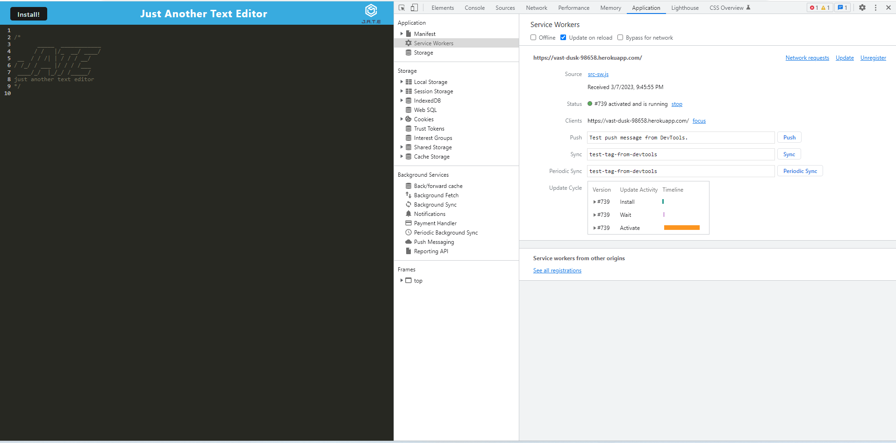
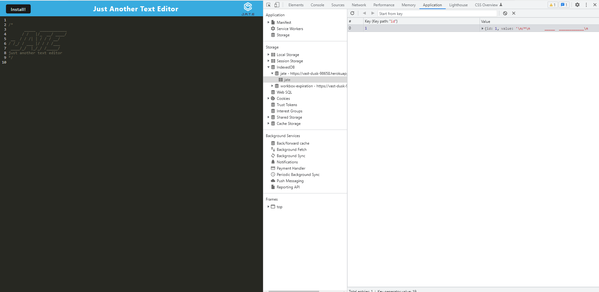

# Text-editor

## *Table of Contents*
 ___
  - [Installation](#description)
  - [Usage](#usage)
  - [Software](#software)
  - [License](#license)
  - [Links](#links)

## *Description*
___
J.A.T.E is a simple text editor app that can function both online and offline, with a variety of data persistence options in order to ensure that data is not lost in any scenario. 
## *Usage*

 
The following image shows the application's manifest.json file:

 
The following image shows the application's registered service worker:

 
The following image shows the application's IndexedDB storage:

## *Software*
___
Social-network-api was built/deployed using the following:
- VSCode
- Gitbash/Github/Heroku
- Webpack
- Node JS
- Express
- Javascript

## *License*
___
This application is covered under the MIT license.
For more information about this license please visit https://opensource.org/licenses/MIT

## *Links*
___
For comments/concerns please contact us at https://github.com/Jelenarog/Text-editor  
Deployed website https://vast-dusk-98658.herokuapp.com/ 

